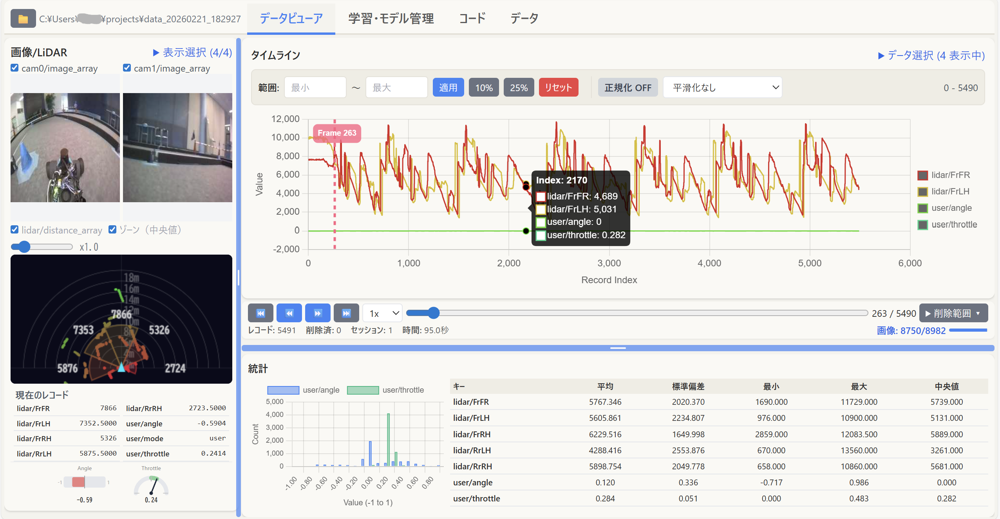
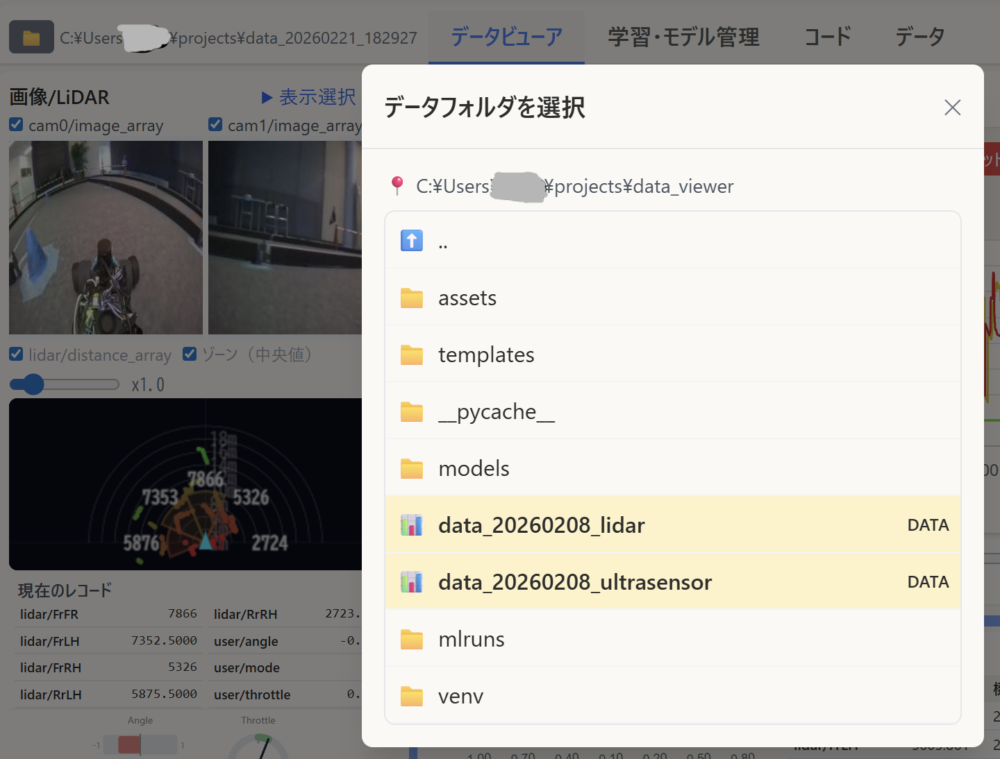

<p align="center">
  
</p>

# Data Viewer

学習データを可視化・管理するための包括的なWebベースビューアアプリケーションです。高度なタイムライン分析、統計情報、データキュレーションツールを搭載しています。

    

## 画面イメージ

### メイン画面（データビューア）



メイン画面は以下のエリアで構成されています：

| エリア | 説明 |
|--------|------|
| **ヘッダー** | 読み込み中のデータフォルダパスと、タブ切り替え（データビューア / 学習・モデル管理 / コード / データ） |
| **画像/LiDARパネル**（左上） | カメラ画像（cam0, cam1等）の表示、LiDAR点群のレーダー風可視化、表示切替チェックボックス |
| **現在のレコード**（左下） | 現在のインデックスにおける全データフィールドの値を等幅フォントで一覧表示。Angle/Throttleのバー表示付き |
| **タイムライン**（右上） | 選択したデータキーの時系列チャート。ズーム・パン・ツールチップ対応。範囲指定・正規化・平滑化の各コントロール |
| **再生コントロール**（中央） | ステップ移動・順逆再生・速度切替・インデックススライダー。レコード数・セッション数・時間の情報表示 |
| **統計**（下部） | ヒストグラムと数値キーの統計テーブル（平均・標準偏差・最小・最大・中央値） |

### データフォルダ選択ダイアログ



ヘッダーのフォルダアイコンをクリックするとフォルダ選択ダイアログが表示されます。Donkeycarデータフォーマットのカタログファイルを含むフォルダは自動検出され、**DATA** バッジ付きの黄色背景でハイライトされます。

## 📋 目次

- [画面イメージ](#画面イメージ)
- [機能](#-機能)
- [インストール](#-インストール)
- [クイックスタート](#-クイックスタート)
- [ユーザーガイド](#-ユーザーガイド)
- [学習機能](#-学習機能)
- [データ構造](#-データ構造)
- [APIリファレンス](#-apiリファレンス)
- [アーキテクチャ](#-アーキテクチャ)
- [トラブルシューティング](#-トラブルシューティング)
- [カスタマイズ](#-カスタマイズ)

## ✨ 機能

### データ管理
- **フォルダブラウザ**: 直感的なファイルシステムナビゲーションでデータフォルダを選択
- **セッションフィルタリング**: 記録セッション別にデータをフィルタリング
- **削除インデックス管理**: 範囲選択で削除データインデックスをマーク・管理
- **自動検出**: Donkeycarのデータフォーマットのカタログファイルを含むフォルダを自動検出
- **状態の自動保存**: パネルサイズ、フォルダ、選択項目を保存し次回アクセス時に復元

### 可視化
- **タイムラインチャート**: Chart.jsによるインタラクティブな時系列可視化
  - ズーム・パン対応
  - 削除インデックスの視覚的マーカー
  - 複数キーのデータプロット
- **ヒストグラム**: 現在のデータ分布のリアルタイムヒストグラム
- **マルチ画像表示**: 複数のカメラフィードとセンサー画像を同時表示
  - 個別の画像ストリームの表示/非表示切り替え
  - スムーズな再生のための自動画像プリロード
  - パネル内でのレスポンシブレイアウト

### データ処理
- **正規化**: データを-1〜1の範囲に正規化して比較
- **平滑化アルゴリズム**:
  - 移動平均（MA）: ウィンドウサイズ 3, 5, 10, 20
  - 指数移動平均（EMA）: αパラメータ 0.1, 0.3, 0.5
  - 数式付きのインタラクティブツールチップ

### 再生コントロール
- **順方向/逆方向再生**: 完全な双方向再生サポート
- **ステップコントロール**: フレーム単位のナビゲーション（⏮ ⏭）
- **可変速度**: 1倍速〜10倍速の再生速度
- **インデックススライダー**: 任意のデータポイントへ直接移動

### 統計パネル
- **リアルタイム統計**: すべての数値キーの自動計算
  - カウント、平均、標準偏差
  - 最小値、最大値、中央値
  - Q1、Q3（四分位数）
- **セッション別フィルタリング**: 選択したセッションに基づいて統計を更新

### 学習・モデル管理
- **ニューラルネットワーク学習**: PyTorchベースのモデル学習（隠れ層・エポック数・学習率等のパラメータ設定可能）
- **継続学習**: 既存モデルから追加エポックの学習を継続
- **MLflow連携**: 学習パラメータ・損失値の自動ログ、MLflow UIでの実験管理
- **モデル管理**: 保存済みモデルの一覧表示・読み込み・削除、保存先フォルダへのリンク
- **予測実行**: 読み込んだモデルでデータに対する予測を実行し、タイムライン上にオーバーレイ表示

### コードタブ
- **ソースコード表示**: 学習に使用しているPyTorchコードをUI上で確認
  - モデル定義（`neural_network.py`）
  - 学習ループ（`_train_model_internal`）
  - データローダー（`_build_input_matrix`）
- **シンタックスハイライト**: highlight.js (vs2015テーマ) によるPython構文のカラー表示
- **データサンプル**: 読み込み済みデータの先頭3件を辞書形式で表示（LiDAR点群の統計値付き）
- **アコーディオン表示**: セクションごとに展開/折りたたみ可能

### データタブ
- **AG Grid**: 仮想スクロール対応の高性能データテーブル（AG Grid Community, MIT）
  - 列ソート・フィルタ・リサイズ
  - 列グループ化（`ultrasonic/*`、`user/*` 等をプレフィックスで自動グループ化）
  - セル内バー表示（`user/angle`、`user/throttle` の値を中央基準のバーで可視化）
  - ヒートマップ色分け（数値列の大小をグラデーションで背景色に反映）
  - 型別フォーマット（整数はそのまま、超音波は小数1桁、操縦値は小数2桁）
  - 画像サムネイルのインライン表示（遅延読み込み対応）

### UI/UX
- **リサイズ可能なパネル**: カスタマイズ可能なワークスペースのためのパネル高さ調整
- **レスポンシブレイアウト**: 異なる画面サイズに適応
- **現在のレコード表示**: 現在のインデックスのすべてのデータフィールドを固定桁数・等幅フォントで表示
- **リモートアクセス対応**: RPi等のサーバー上で実行し、別PCのブラウザからアクセス可能

## 🚀 インストール

### 必要要件

- Python 3.11 または 3.12
- pip（Pythonパッケージマネージャー）
- モダンWebブラウザ（Chrome、Firefox、Edge、Safari）

### 依存関係

仮想環境作成

```bash
python -m venv venv

# rpi
source ./venv/bin/activate

# windows
./venv/bin/activate

```

必要なPythonパッケージをインストール：

```bash
pip install -r requirements.txt
```

**主要な依存パッケージ**:
```
Flask==2.3.3
flask-cors==4.0.0
numpy==1.26.4
Werkzeug==2.3.7
torch>=2.0.0,<=2.3.1  # ニューラルネットワーク学習（RPi4互換）
torchvision>=0.15.0,<=0.18.1
mlflow>=2.10.0        # 実験管理・学習ログ
Pillow                # 画像処理（画質調整）
send2trash>=1.8.0     # ファイル削除（ゴミ箱経由）
```

> **Raspberry Pi 4 ユーザーへの注意**: PyTorch 2.4.0 以降は `libarm_compute` 内で LSE（Large System Extensions）命令（`ldaddal` 等）を使用しており、RPi4 の Cortex-A72（ARMv8.0）では `Illegal instruction` が発生します。`requirements.txt` では PyTorch 2.3.1 以下に制限しています。

## 🎯 クイックスタート

### 1. アプリケーションの起動

```bash
python app.py
```

または、提供されているシェルスクリプトを使用（Linux/Mac）：
```bash
chmod +x run.sh
./run.sh
```

### 2. Webインターフェースへのアクセス

**ローカルアクセス**:
```
http://localhost:5000
```

**リモートアクセス**（同じネットワーク上の別デバイスから）:
```
http://[あなたのIPアドレス]:5000
```

Raspberry Piユーザー向け：
```bash
# IPアドレスを確認
hostname -I
```

### 3. データの読み込み

1. **"Select Data Folder"** ボタンをクリック
2. データフォルダ（`data/` サブディレクトリを含む）に移動
3. **"Load Data"** をクリックして選択したフォルダを読み込み
4. すべてのパネルにデータが読み込まれ表示されます

## 📖 ユーザーガイド

### パネルレイアウト

アプリケーションは4つのリサイズ可能なパネルで構成されています：

1. **Imagesパネル**（上部）: カメラとセンサー画像の表示
2. **Timelineパネル**: 時系列チャートの可視化
3. **Statisticsパネル**: 数値データの統計情報
4. **Histogramパネル**（下部）: データ分布の可視化

**パネルのリサイズ**: パネル間の水平バーをドラッグして高さを調整します。

### タイムラインコントロール

**データ選択**:
- ドロップダウンを使用して可視化するデータキーを選択
- 複数の数値キーが利用可能（例: `user/throttle`、`user/angle`）

**正規化**:
- **"正規化"** ボタンをクリックしてデータを-1〜1の範囲に正規化
- 異なるスケールのデータを同じチャート上で比較するのに便利

**平滑化**:
- ドロップダウンから平滑化アルゴリズムを選択：
  - **なし**: 生データ
  - **MA-3, MA-5, MA-10, MA-20**: ウィンドウサイズ付き移動平均
  - **EMA-0.1, EMA-0.3, EMA-0.5**: αパラメータ付き指数移動平均
- オプションにマウスオーバーすると数式が表示されます

**チャートの操作**:
- **ズーム**: スクロールホイールまたはピンチジェスチャー
- **パン**: クリック＆ドラッグ
- **ズームリセット**: チャートをダブルクリック

### 再生コントロール

Timelineパネルの下に配置：

- **⏮ Step Backward**: 前のフレームへ移動
- **⏪ Play Reverse**: 選択した速度で逆再生
- **⏩ Play Forward**: 選択した速度で順再生
- **⏭ Step Forward**: 次のフレームへ移動
- **Speed Selector**: 1倍、2倍、5倍、10倍の再生速度

**インデックススライダー**: ドラッグして任意のデータポイントへ直接移動。

### 削除インデックス管理

データの範囲を削除マーク（不良な学習データの除去に便利）：

1. **開始インデックスの設定**:
   - 手動で値を入力するか、**"現在"** ボタンをクリックして現在のインデックスを使用
2. **終了インデックスの設定**:
   - 手動で値を入力するか、**"現在"** ボタンをクリックして現在のインデックスを使用
3. **削除の適用**:
   - **"削除設定"** をクリックして範囲を削除としてマーク
4. **削除のクリア**:
   - **"削除クリア"** をクリックして範囲のマークを解除

**注意事項**:
- デフォルト範囲は0から最大インデックス
- 削除インデックスは `manifest.json` に保存されます
- 削除範囲はTimelineチャート上に赤いボックスで表示されます
- 削除されたデータはマークされますが、物理的には削除されません

### 画像プリロード

フォルダ読み込み時に全画像をバックグラウンドで一括プリロードします。
- 進捗バーがヘッダーに表示されます
- 再生開始・スライダー移動時は現在位置から優先的にプリロード
- 画質を落としてプリロードするため、高速に読み込めます（quality=50）

### 画像表示コントロール

**画像の表示/非表示**:
- 画像キー名をクリックして表示/非表示を切り替え
- **"すべて"** ボタン: すべての画像のオン/オフを切り替え
- 画像は自動的にパネルに合わせてスケーリングされます

### セッションフィルタリング

データに複数の記録セッションが含まれている場合：
- **Session** ドロップダウンを使用してセッションIDでフィルタリング
- すべてのパネルが選択したセッションのデータのみを表示するように更新されます

### 状態の自動保存と復元

次回アクセス時に以下の設定が自動的に復元されます：

- **パネルサイズ**: Imagesパネルの幅、Timelineパネルの高さ
- **読み込んだフォルダ**: 前回読み込んだフォルダを自動的に読み込み
- **Select Data選択**: Timelineで選択したデータキーの表示状態
- **Select Images選択**: 画像の表示/非表示設定

設定はブラウザのlocalStorageに保存されます。

## 🧠 学習機能

### タブ構成

画面上部のタブでビューを切り替えます：

- **データビューア**: タイムライン・画像・統計・ヒストグラム等のデータ可視化
- **学習・モデル管理**: ニューラルネットワークの学習実行とモデル管理
- **コード**: 学習に使用しているPyTorchソースコードとデータサンプルの閲覧
- **データ**: AG Gridによる全レコードの一覧表示（ソート・フィルタ・画像サムネイル付き）

### 学習タブ

「学習・モデル管理」タブから学習機能にアクセスできます。

**データ設定**:
- データ範囲の指定（開始〜終了インデックス）
- ダウンサンプリングレート
- 削除対象データの件数表示

**学習パラメータ**:
- 入力センサー・出力キーの選択
- 隠れ層の構造（例: `[64, 32]`）
- エポック数、バッチサイズ、学習率
- ドロップアウト率

**学習の実行**:
1. データ設定とパラメータを設定
2. 「学習開始」をクリック
3. 学習曲線（Train Loss / Val Loss）がリアルタイムで表示
4. 完了後、モデルが `models/` フォルダに自動保存

**継続学習**: 既存モデルを選択した状態で「継続学習」をクリックすると、そのモデルの重みを引き継いで追加学習が可能です。

### モデル管理

- 保存済みモデル一覧から選択して読み込み
- モデルの構造（入力→隠れ層→出力）、エポック数を確認
- 保存先フォルダのパスをクリックするとエクスプローラーで開く
- 「予測実行」で現在のデータに対する推論結果をタイムラインにオーバーレイ表示

### MLflow UI

学習ログはMLflowで自動管理されます。

- 「MLflow UIを開く」ボタンでMLflow UIがポート5001で起動
- ハイパーパラメータ、損失値、モデルが自動記録
- リモートアクセス時もブラウザのホスト名で自動的に正しいURLに接続

## 📁 データ構造

### 期待されるフォルダ構造

```
data_folder/
├── data/
│   ├── catalog_0.catalog       # データレコード（JSON行）
│   ├── catalog_1.catalog
│   ├── catalog_N.catalog
│   ├── manifest.json           # メタデータと設定
│   ├── images/
│   │   ├── 0_cam_image_array_.jpg
│   │   ├── 1_cam_image_array_.jpg
│   │   └── ...
│   └── lidar/                  # LiDAR点群データ（オプション）
│       ├── 00000_lidar_distance_array_.npy
│       ├── 00001_lidar_distance_array_.npy
│       └── ...
```

### マニフェストファイル形式

`manifest.json` ファイルは5行で構成：

1. **1行目**: データキー（JSON配列）
2. **2行目**: データ型（JSON配列）
3. **3行目**: 空行
4. **4行目**: メタデータ（JSONオブジェクト）
5. **5行目**: カタログマニフェスト（JSONオブジェクト）
   ```json
   {
     "max_len": 1000,
     "deleted_indexes": [10, 11, 12, 150, 151]
   }
   ```

### カタログファイル

各カタログファイルはレコードを含むJSON行で構成：

```json
{"_index": 0, "_session_id": "session_001", "_timestamp_ms": 1234567890, "user/throttle": 0.5, "user/angle": -0.1, "cam/image_array": "images/0_cam_image_array_.jpg"}
{"_index": 1, "_session_id": "session_001", "_timestamp_ms": 1234567990, "user/throttle": 0.6, "user/angle": 0.0, "cam/image_array": "images/1_cam_image_array_.jpg"}
```

**特別なキー**:
- `_index`: カタログ内のローカルインデックス（max_len=1000の場合0-999）
- `_absolute_index`: すべてのカタログを通じたグローバルインデックス（`catalog_num * max_len + _index` として計算）
- `_session_id`: 記録セッション識別子
- `_timestamp_ms`: ミリ秒単位のタイムスタンプ
- `_is_deleted`: 実行時に削除されたレコードをマークするために追加

## 🔌 APIリファレンス

### ディレクトリブラウズ

```http
GET /api/browse?path=/path/to/directory
```

**レスポンス**:
```json
{
  "current_path": "/path/to/directory",
  "items": [
    {
      "name": "folder_name",
      "path": "/full/path",
      "type": "directory",
      "is_data_folder": true
    }
  ]
}
```

### データ読み込み

```http
POST /api/load_data
Content-Type: application/json

{
  "folder_path": "/path/to/data_folder"
}
```

**レスポンス**:
```json
{
  "success": true,
  "info": {
    "total_records": 5000,
    "sessions": ["session_001", "session_002"],
    "data_keys": ["user/throttle", "user/angle", ...],
    "timestamp_range": {
      "min": 1234567890,
      "max": 1234657890,
      "duration_ms": 90000
    },
    "deleted_indexes": [10, 11, 12]
  }
}
```

### データレコード取得

```http
GET /api/data?start=0&end=100&session=session_001
```

**パラメータ**:
- `start`: 開始インデックス（デフォルト: 0）
- `end`: 終了インデックス（オプション、デフォルト: すべて）
- `session`: セッションIDフィルタ（オプション）

**レスポンス**:
```json
{
  "records": [...],
  "total": 5000
}
```

### 統計取得

```http
GET /api/statistics?key=user/throttle&session=session_001
```

**レスポンス**:
```json
{
  "user/throttle": {
    "count": 5000,
    "mean": 0.45,
    "std": 0.15,
    "min": 0.0,
    "max": 1.0,
    "median": 0.5,
    "q1": 0.3,
    "q3": 0.6
  }
}
```

### タイムラインデータ取得

```http
GET /api/timeline?key=user/throttle&session=session_001
```

**レスポンス**:
```json
{
  "key": "user/throttle",
  "data": [
    {"timestamp": 1234567890, "value": 0.5, "index": 0},
    {"timestamp": 1234567990, "value": 0.6, "index": 1}
  ]
}
```

### 削除インデックスの更新

```http
POST /api/delete_indexes
Content-Type: application/json

{
  "start_idx": 100,
  "end_idx": 200
}
```

**レスポンス**:
```json
{
  "success": true,
  "deleted_indexes": [10, 11, 12, 100, 101, ..., 200],
  "count": 104
}
```

### 削除インデックスのクリア

```http
POST /api/clear_delete_indexes
Content-Type: application/json

{
  "start_idx": 100,
  "end_idx": 200
}
```

**レスポンス**:
```json
{
  "success": true,
  "deleted_indexes": [10, 11, 12],
  "count": 3
}
```

### 画像取得

```http
GET /api/image/<image_path>?quality=50
```

JPEG画像ファイルを返します。`quality`パラメータ（1-94）で画質を指定可能です。

### 画像一括取得

```http
POST /api/images_batch
Content-Type: application/json

{
  "paths": ["0_cam_image_array_.jpg", "1_cam_image_array_.jpg"],
  "quality": 50
}
```

**レスポンス**: base64エンコードされた画像データのJSON
```json
{
  "images": {
    "0_cam_image_array_.jpg": "<base64>",
    "1_cam_image_array_.jpg": "<base64>"
  }
}
```

### モデル一覧

```http
GET /api/models
```

**レスポンス**:
```json
{
  "models": [...],
  "models_dir": "C:/path/to/models"
}
```

### ソースコード取得

```http
GET /api/code
```

**レスポンス**:
```json
{
  "sections": [
    {"title": "モデル定義 (neural_network.py)", "code": "..."},
    {"title": "学習ループ (_train_model_internal)", "code": "..."},
    {"title": "データローダー (_build_input_matrix)", "code": "..."},
    {"title": "データサンプル（先頭 3 件 / 全 1200 件）", "code": "..."}
  ]
}
```

データサンプルセクションはデータ読み込み済みの場合のみ含まれます。LiDAR `.npy` ファイルがある場合は点群の統計値（点数・min・max・mean）も表示されます。

### MLflow UI起動

```http
POST /api/mlflow/start
```

MLflow UIをポート5001で起動します。

### フォルダを開く

```http
POST /api/open_folder
Content-Type: application/json

{
  "path": "C:/path/to/folder"
}
```

サーバー側でシステムのファイルエクスプローラーを開きます。

## 🏗 アーキテクチャ

### 技術スタック

**バックエンド**:
- Flask 2.3（Python Webフレームワーク）
- Flask-CORS（クロスオリジンリソース共有）
- NumPy（統計計算）
- PyTorch（ニューラルネットワーク学習・推論）
- MLflow（実験管理・モデル管理）
- Pillow（画像処理・画質調整）

**フロントエンド**:
- React 18（UIフレームワーク、Babel standaloneを使用）
- Chart.js 4.4（タイムラインとヒストグラムチャート）
- chartjs-plugin-annotation（削除インデックスマーカー）
- chartjs-plugin-zoom（インタラクティブズーム）
- Plotly.js（学習曲線表示）
- AG Grid Community 32.3（データタブのテーブル表示、MIT）
- highlight.js 11.9（コードタブのシンタックスハイライト）
- Tailwind CSS（スタイリングフレームワーク）

### ファイル構造

```
data_viewer/
├── app.py                  # FlaskアプリケーションとAPIエンドポイント
├── data_loader.py          # データ読み込みと処理ロジック
├── neural_network.py       # ニューラルネットワークモデル定義
├── training_manager.py     # 学習管理・MLflow連携
├── requirements.txt        # Python依存関係
├── run.sh                  # 起動スクリプト
├── templates/
│   └── index.html         # シングルページReactアプリケーション
├── models/                 # 学習済みモデルの保存先
├── mlruns/                 # MLflow実験ログ
└── README.md              # このファイル
```

### データフロー

1. **ユーザーがフォルダを選択** → ブラウザが `/api/browse` にパスを送信
2. **ユーザーがデータを読み込み** → `/api/load_data` にPOST → `DataLoader` がカタログを読み込み
3. **レコードが読み込まれる** → インデックスをマッピングしてメモリに保存
4. **ユーザーがナビゲート** → ページネーション付きで `/api/data` にGET
5. **タイムラインをレンダリング** → 選択したキーで `/api/timeline` にGET
6. **統計を更新** → 数値キーに対して `/api/statistics` にGET
7. **ユーザーが削除をマーク** → `/api/delete_indexes` にPOST → `manifest.json` の5行目を更新

### パフォーマンス最適化

- **バッチ画像API**: 50枚単位の一括取得でHTTPオーバーヘッドを大幅削減
- **Blob URLキャッシュ**: 画像をメモリ内のblob URLとしてキャッシュし、再生時のHTTPリクエストを不要に
- **優先プリロード**: 再生開始・スライダー移動時に現在位置から優先的にプリロード
- **画質調整プリロード**: プリロード時はJPEG quality=50で転送量を削減
- **Mapベースルックアップ**: 削除インデックスチェックでO(n²)ではなくO(n)
- **ズーム範囲フィルタリング**: 表示可能なチャート領域内のアノテーションのみをレンダリング
- **ページネーション**: チャンクでデータを読み込みメモリ使用量を削減
- **スライダーデバウンス**: スライダー操作時のリクエスト抑制（80msデバウンス）

## 🔧 トラブルシューティング

### ポートが既に使用中

**エラー**: `OSError: [Errno 98] Address already in use`

**解決策**:
```bash
# ポート5000を使用しているプロセスを見つけて終了
lsof -ti:5000 | xargs kill -9

# または別のポートを使用
python app.py  # app.pyを編集してポートを変更
```

### CORSエラー

**エラー**: `Access to fetch at 'http://...' from origin 'http://...' has been blocked by CORS policy`

**解決策**: Flask-CORSは既に設定されています。`flask-cors`がインストールされていることを確認：
```bash
pip install flask-cors
```

### 画像が読み込まれない

**症状**: タイムラインと統計は機能するが、画像が壊れて表示される

**考えられる原因**:
1. カタログ内の画像パスが実際のファイルの場所と一致しない
2. imagesフォルダが見つからないか間違った場所にある
3. ファイルパーミッションの問題

**解決策**:
```bash
# データ構造を確認
ls -la data_folder/data/images/

# カタログ内の画像パスが実際のファイルと一致するか確認
cat data_folder/data/catalog_0.catalog | head -1 | python -m json.tool
```

### 削除インデックスが保持されない

**症状**: 削除インデックスが再起動後にリセットされる

**原因**: マニフェストファイルが書き込み不可または形式が間違っている

**解決策**:
```bash
# マニフェストファイルのパーミッションを確認
ls -la data_folder/data/manifest.json

# マニフェストが5行あることを確認
wc -l data_folder/data/manifest.json

# 5行目にcatalog_manifestが含まれているか確認
sed -n '5p' data_folder/data/manifest.json
```

### 大規模データセットでのパフォーマンス問題

**症状**: 10,000レコード超で読み込みやチャートレンダリングが遅い

**解決策**:
1. セッションフィルタリングを使用して表示データを削減
2. コード内のページネーション制限を調整
3. 非常に大規模なデータセットの場合はデータ間引きを検討

### MLflow UIが開かない

**症状**: 「MLflow UIを開く」をクリックしても `ERR_CONNECTION_REFUSED` が表示される

**考えられる原因と解決策**:
1. **mlflowが未インストール**: venv内にmlflowがインストールされているか確認
   ```bash
   pip install mlflow
   ```
2. **ブラウザキャッシュ**: `Ctrl+F5` でハードリロード
3. **起動に時間がかかっている**: 数秒待ってからポート5001に手動アクセス

### Raspberry Pi 4 で Illegal instruction が発生する

**症状**: `python app.py` 実行時やモデル学習時に `Illegal instruction` でクラッシュする

**原因**: PyTorch 2.4.0 以降、`libarm_compute` ライブラリ内で LSE（Large System Extensions）命令（`ldaddal` 等）が使用されるようになりました。この命令は ARMv8.1 以降が対象で、Raspberry Pi 4 の Cortex-A72（ARMv8.0）では非対応です。

**解決策**: PyTorch 2.3.1 にダウングレード
```bash
# 現在のtorchをアンインストール
pip uninstall torch torchvision torchaudio -y

# 2.3.1 をインストール
pip install torch==2.3.1 torchvision==0.18.1
```

`requirements.txt` では既にバージョン上限を設定済みです（`torch<=2.3.1`）。新規インストールの場合は `pip install -r requirements.txt` で問題ありません。

### ブラウザ互換性

**テスト済みブラウザ**:
- ✅ Chrome 90+
- ✅ Firefox 88+
- ✅ Edge 90+
- ✅ Safari 14+

**既知の問題**:
- Internet Explorerはサポート外（ES6+機能が必要）

## 🎨 カスタマイズ

### カラースキームの変更

`templates/index.html` のCSS変数を編集：

```css
:root {
    --bg-main: #f5f3ed;      /* メイン背景 */
    --bg-panel: #faf9f5;     /* パネル背景 */
    --bg-hover: #f0ede4;     /* ホバー状態 */
    --bg-input: #ffffff;     /* 入力フィールド */
    --border-color: #e5e1d8; /* ボーダー */
    --text-primary: #2d2d2d; /* プライマリテキスト */
    --text-secondary: #5a5a5a; /* セカンダリテキスト */
}
```

### 新しいデータ処理の追加

`data_loader.py` を拡張：

```python
def custom_processing(self, key):
    """カスタム処理ロジック"""
    values = [r.get(key) for r in self.records if key in r]
    # 値を処理
    return processed_values
```

`app.py` にAPIエンドポイントを追加：

```python
@app.route('/api/custom_endpoint', methods=['GET'])
def custom_endpoint():
    result = data_loader.custom_processing(request.args.get('key'))
    return jsonify({'result': result})
```

### 新しい平滑化アルゴリズムの追加

`templates/index.html` の平滑化セクションを編集：

```javascript
const applySmoothing = (data, option) => {
    // カスタム平滑化オプションを追加
    if (option.startsWith('custom-')) {
        // アルゴリズムをここに記述
        return smoothedData;
    }
    // ... 既存のコード
};
```

### パネルレイアウトの変更

Reactステートで初期パネル高さを調整：

```javascript
const [panelHeights, setPanelHeights] = React.useState({
    images: 25,    // パーセンテージ
    timeline: 35,
    statistics: 20,
    histogram: 20
});
```

## 📝 ライセンス

MIT License - プロジェクトで自由に使用・修正できます。

### 利用ライブラリとライセンス

本プロジェクトは以下のオープンソースライブラリを利用しています。各ライブラリのライセンス条項に従ってご利用ください。

#### Python パッケージ

| ライブラリ | ライセンス | 用途 |
|-----------|-----------|------|
| [Flask](https://flask.palletsprojects.com/) | BSD-3-Clause | Web フレームワーク |
| [flask-cors](https://github.com/corydolphin/flask-cors) | MIT | CORS 対応 |
| [NumPy](https://numpy.org/) | BSD-3-Clause | 統計計算 |
| [Werkzeug](https://werkzeug.palletsprojects.com/) | BSD-3-Clause | WSGI ユーティリティ |
| [PyTorch](https://pytorch.org/) | BSD-3-Clause | ニューラルネットワーク学習・推論 |
| [torchvision](https://pytorch.org/vision/) | BSD-3-Clause | 画像処理ユーティリティ |
| [MLflow](https://mlflow.org/) | Apache-2.0 | 実験管理・学習ログ |
| [Pillow](https://python-pillow.org/) | HPND (MIT 類似) | 画像処理・画質調整 |
| [Send2Trash](https://github.com/arsenetar/send2trash) | BSD-3-Clause | ファイル削除（ゴミ箱経由） |

#### フロントエンド（CDN）

| ライブラリ | ライセンス | 用途 |
|-----------|-----------|------|
| [React / ReactDOM 18](https://react.dev/) | MIT | UI フレームワーク |
| [Babel Standalone](https://babeljs.io/) | MIT | JSX トランスパイル |
| [Chart.js](https://www.chartjs.org/) | MIT | タイムライン・ヒストグラムチャート |
| [chartjs-plugin-annotation](https://github.com/chartjs/chartjs-plugin-annotation) | MIT | 削除インデックスマーカー |
| [chartjs-plugin-zoom](https://github.com/chartjs/chartjs-plugin-zoom) | MIT | チャートのズーム・パン |
| [Plotly.js](https://plotly.com/javascript/) | MIT | 学習曲線の表示 |
| [Tailwind CSS](https://tailwindcss.com/) | MIT | スタイリング |
| [highlight.js](https://highlightjs.org/) | BSD-3-Clause | コードのシンタックスハイライト |
| [AG Grid Community](https://www.ag-grid.com/) | MIT | データテーブル表示 |

> **注意事項**
> - AG Grid は **Community 版（MIT）** を使用しています。Enterprise 版の機能を利用する場合は別途商用ライセンスが必要です。
> - PyTorch を CUDA 付きで利用する場合、NVIDIA CUDA ライブラリには [NVIDIA CUDA EULA](https://docs.nvidia.com/cuda/eula/index.html) が適用されます。
> - MLflow（Apache-2.0）はソースコードを再配布する場合、NOTICE ファイルの保持と変更の明示が必要です。


## 📧 サポート
データフォーマットはDonkeycarの形式を採用しています。
Donkeycar自体に関する問題については、https://www.donkeycar.com/ をご覧ください。

---
